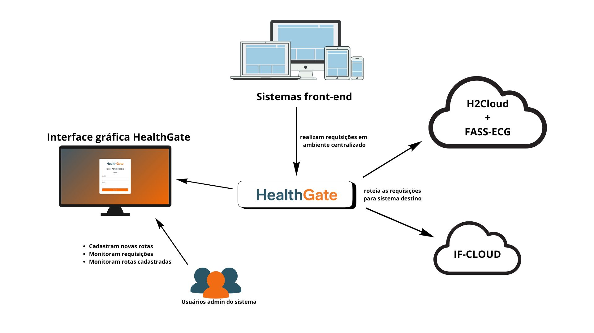

# HealthGate
### O **HealthGate** é um sistema projetado para facilitar a integração dos sistemas desenvolvidos no grupo IF4heath: https://if4health.netlify.app/. Ele permite o cadastro e gerenciamento de rotas existentes nos sistemas FASS-ECG, IF-CLOUD e H2Cloud, criando um Gateway eficiente e seguro para rotear requisições.


## Funcionalidades

- **CRUD de rotas**: Gerencie rotas dos sistemas FASS-ECG (https://github.com/if4health/neoFASS-Ecg), IF-CLOUD (https://github.com/if4health/ifcloud/tree/auth-neoFASS) e neoFassEcg (https://github.com/if4health/neoFASS-Ecg).
- **Autenticação JWT**: Proteção de rotas administrativas com autenticação baseada em tokens.
- **Redirecionamento dinâmico**: Roteamento de requisições para URLs de destino configuradas.
- **Logs de requisições**: Registro de requisições e respostas no MongoDB para auditoria.
- **Suporte a múltiplos métodos HTTP**: GET, POST, PUT, PATCH e DELETE.

## Tecnologias Utilizadas

- **Node.js**: Plataforma para o backend.
- **Express.js**: Framework para construir a API RESTful.
- **Axios**: Biblioteca para realizar requisições HTTP.
- **MongoDB**: Banco de dados utilizado para armazenamento.
- **EJS**: Template engine para renderização de páginas no frontend.
- **React**: Utilizado para a interface do frontend.
- **dotenv**: Gerenciamento de variáveis de ambiente.

## Pré-requisitos

Antes de executar o projeto, certifique-se de que as seguintes dependências estejam instaladas:

- **Node.js** (versão 14.x ou superior)
- **NPM** ou **Yarn** para gerenciar pacotes
- **MongoDB** para armazenamento de dados
- **Acesso ao servidor FHIR** para testar a integração

## Instalação

1. Baixe o MongoDB a partir do [site oficial](https://www.mongodb.com/try/download/community).
   - Siga o assistente de instalação e certifique-se de marcar a opção "Run MongoDB as a Service".
   - Após a instalação, abra o terminal e execute o comando `mongod` para iniciar o MongoDB.

2. Clone o repositório do projeto:
   ```bash
   git clone https://github.com/MariaEduarda004/healthGate.git
   cd health-gate
   ```

3. Instale as dependências:
   - Com npm:
     ```bash
     npm install
     ```
   - Ou com Yarn:
     ```bash
     yarn install
     ```

4. Configure as variáveis de ambiente no arquivo `.env`. Exemplo:
   ```bash
   JWT_SECRET=<seu jwt aqui>
   FASS_ECG_AUTH_URL=https://if4health.charqueadas.ifsul.edu.br/biosignalinfhir/auth/token
   FASS_ECG_CLIENT_ID=gateway
   FASS_ECG_AUTH_CODE= <code gerado pelo H2Cloud>
   ```

5. Inicie o servidor de backend:
   -  Vá a pasta backend:
     ```bash
     cd .\backend\
     ```
   - Com npm:
     ```bash
     npm start
     ```
   - Ou com Yarn:
     ```bash
     yarn start
     ```
6. Inicie o mongo:
   -  Vá a pasta db:
     ```bash
     cd .\db\
     ```
   -  Inicie o mongo:
     ```bash
     mongod --dbpath "C:\TCC1\Health-Gate\db\datadb"
     ```

O sistema estará disponível em [http://localhost:3001](http://localhost:3001).

